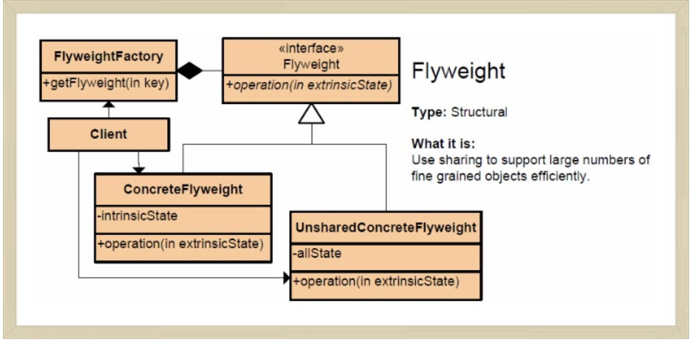

# Domain-Driven Design(도메인 주도 설계)

## 소프트웨어에서 표현되는 MODEL

### **연관관계**
---
현실세계에는 수많은 다대다(Many to Many) 연관관계가 있으며, 그 중 상당수는 애초부터 양방향으로 나타난다. 이러한 양방향의 연관관계는 구현과 유지보수를 복잡하게 하며, 더욱이 해당 관계의 특성이 드러나지 않는다.  

연관관계를 간소화 하는 방법 세가지
- 탐색 방향을 부여한다.
- 한정자를 추가해서 사실상 다중성을 줄인다.
- 중요하지 않은 연관관계를 제거한다.

도메인의 특성이 반영되게끔 연관관계를 일관되게 제약하면 연관관계의 의사전달력이 풍부해지고 구현이 단순해지며, 나머지 양방향 연관관계도 의미를 지니게 된다. 관계의 양방향성이 도메인의 의미적 특징에 해당하고, 애플리케이션 기능에 그러한 양방향성이 필요하다면 두 가지 탐색 방향을 모두 유지하는 것은 그와 같은 사실을 나타내는 셈이다.

***결론 : 가능하면 최대한 연관관계를 제약하자!***

### **1. ENTITY(엔티티, 참조객체)**
---
- 식별성이 정의된 객체
- 자신의 생명주기 동안 형태와 내용이 변경될 수 있지만, 연속성은 유지

현실 세계에서 같은 사물이라도 도메인 모델에서는 ENTITY로 표현되거나 표현되지 않을 수 있다.
좌석을 예로 들면, 예약을 위한 애플리케이션을 개발할 경우 좌석은 각각의 식별번호를 가진 ENTITY로 분류된다. 하지만 입장권을 가진 사람이 빈 좌석을 찾아 아무데나 앉을 수 있도록 애플리케이션을 구성한다면 좌석은 식별번호를 가질 필요가 없기 때문에 ENTITY가 아니게 된다.

**ENTITY 모델링**  
ENTITY를 구성할 때 개념에 필수적인 행위만 추가하고 그 행위에 필요한 속성만 추가한다. 그 밖의 객체는 행위와 속성을 검토해서 가장 중심이 되는 ENTITY와 연관관계에 있는 다른 객체로 옮긴다. 이들은 다른 ENTITY 또는 VALUE OBJECT가 된다.

### **2. VALUE OBJECT(값 객체)**
---
개념적 식별성을 갖지 않으면서 도메인의 서술적 측면을 나타내는 객체를 VALUE OBJECT라 한다.
- VALUE OBJECT는 불변적이어야 한다.
- VALUE OBJECT는 단순해야 한다.

*특별한 경우 : 변경가능성을 허용하는경우*  
*- VALUE가 자주 변경되는 경우*  
*- 객체 생성이나 삭제에 비용이 많이 드는 경우*  
*- 공유할 일이 그리 많지 않는 경우*    
*VALUE의 구현이 변경 가능하다면 공유해서는 안된다. VALUE의 공유 여부와는 관계없이 VALUE OBJECT는 가급적 변하지 않게 설계한다.*

VALUE OBJECT의 불변성과 공유를 이용한 패턴 > FlyWeight Pattern

### **3. SERVICE(서비스)**
---
도메인의 개념 가운데 객체로는 모델에 어울리지 않는 것이 있다. 필요한 도메인 기능을 ENTITY나 VALUE OBJECT에서 억지로 맡게 하면 모델에 기반을 둔 객체의 정의가 왜곡되거나, 또는 무의미하고 인위적으로 만들어진 객체가 추가될 것이다.  
SERVICE는 모델에서 독립적인 인터페이스로 제공되는 연산으로서 ENTITY나 VALUE OBJECT와 달리 **상태를 캡슐화하지 않는다.**   

**잘 만들어진 SERVICE의 세가지 특징**
1. 연산이 원래부터 ENTITY나 VALUE OBJECT의 일부를 구성하는 것이 아니라 도메인 개념과 관련돼 있다.
2. 인터페이스가 도메인 모델의 외적 요소의 측면에서 정의된다.
3. 연산이 상태를 갖지 않는다.

### 4. MODULE(모듈, 패키지)
--- 
MODULE간에는 결합도가 낮아야 하고 MODULE 내부는 응집도가 높아야 한다는 것은 두말하면 잔소리다. 결합도와 응집도에 대한 설명은 그것을 기술적인 측정 기준처럼 들리게 해서 연관과계와 상호 작용의 배분 방법에 근거해 결합도와 응집도의 정도를 기계적으로 판단하게 만든다. 그러나 **MODULE로 쪼개지는 것은 코드가 아닌 바로 개념**이다. 어떤 사람이 한번에 생각해낼 수 있는 양에는 한계가 있으며, 일관성이 없는 단편적인 생각은 획일적인 생각을 섞어 놓은 것처럼 이해하기 어렵다. 