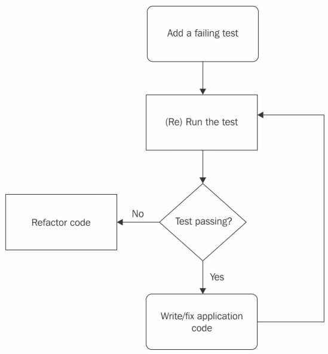

# Only Way to Learn TDD
실제로 많은 개발자들이 TDD에 관심을 갖고 블로그나 책을 통해 학습을 한다. 그러나 막상 TDD를 업무에 적용하기에는 쉽지 않다.
내가 그들에게 해줄 수 있는 조언은 매우 간단하다.

> 매일 아침 30분, 2주 동안 TDD Kata를 푸는 것이다. 하나를 해결하면 다른 kata를 하는 식이다.

##### 그래서 TDD Kata가 뭔데?

Kata 는 일본어로 "무술 동작"을 의미하는 데, 1999년 Dave Thomas 가 실용주의 프로그래머 "The Pragmatic Programmer"에서 언급하였다. 

무술의 오랜 연마를 통해 의식하지 않아도 근육이 동작을 기억하는 것처럼 
TDD 역시 하루에 딱 30분 2주동안 반복적인 Kata를 통해 훈련될 수 있다는 것이다.

티린이 (TDD 어린이) 에게 TDD가 어려운 이유는 코드를 작성하는 기본 방법과 자세를 바꿔야하기 때문이다. 단순히 현재 테스트를 더 많이 하는 것을 말하는 것도 아니며 
특히나 real code에서 개발을 해오던 개발자들에게는 더더욱 어렵다.

#### 매일 30분씩 2주 동안?

일단 워밍업 차원에서 매일 아침 모닝커피와 함께 Kata를 하나 골라 30분만 2주동안 해보길 권장한다. 하나가 끝나면 다른 Kata를 골라 반복적으로 2주동안 매일 시행한다.
단 이 동안에는 실제 업무에 TDD를 적용하지 않는다. 충분히 TDD 사이클이 몸에 베이기 전까지는 기다려라.
또한 훈련 동안에는 반드시 아래의 TDD 사이클을 따라야 한다. 

---

TDD 사이클 "__RED-GREEN-REFACTOR-REPEAT__"

#### Kata 문제
[A collection of TDD exercises that are useful as katas](https://github.com/mwhelan/Katas)

